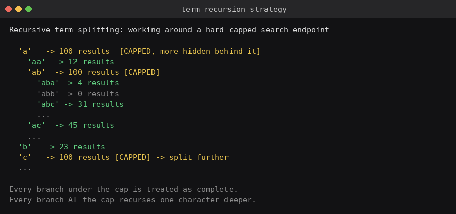
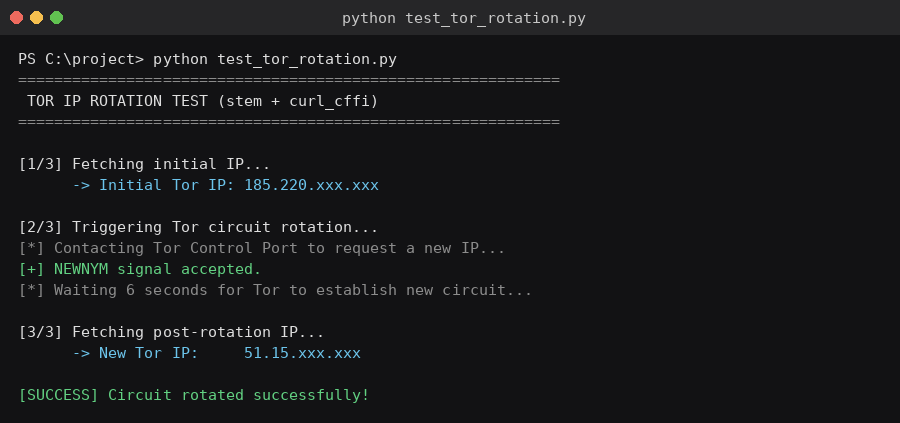
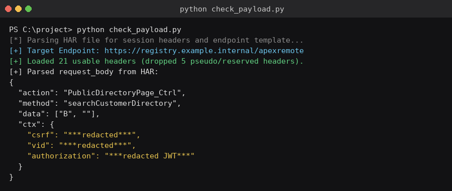
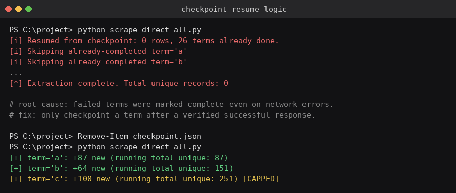
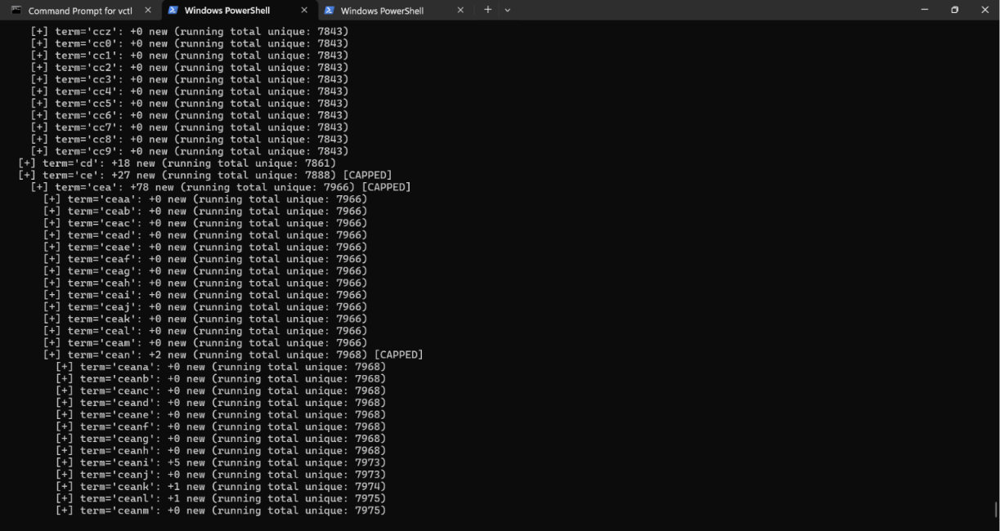
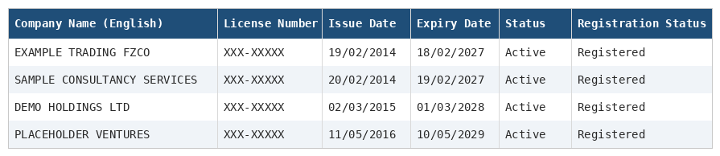

# public-registry-scraper


A full-coverage extraction pipeline for a captcha-gated public company registry — solves the search form's reCAPTCHA once via a real browser session, then replays the site's own internal RPC API directly to pull every registered entity, recursively splitting search terms to get past the endpoint's hard cap on results per query.

---

## Table of Contents

- [Overview](#overview)
- [How It Works](#how-it-works)
- [The Journey](#the-journey)
- [Sample Output](#sample-output)
- [Features](#features)
- [Project Structure](#project-structure)
- [Installation](#installation)
- [Usage](#usage)
- [Configuration](#configuration)
- [Limitations](#limitations)
- [Roadmap](#roadmap)
- [Links](#links)
- [License](#license)

---

## Overview

Many public company registries aren't static pages — the search form itself often lives inside a cross-origin iframe served by a third-party platform, gated behind a reCAPTCHA, with no documented public API and no bulk export.

This project reverse-engineers that page's own network traffic to talk to its internal API directly: solve the captcha **once** in a real browser, capture the authenticated session as a HAR file, then replay the exact RPC call the page itself makes — at full speed, with zero captchas per request.

<p align="center">
  
  <br/>
  <sub>The search form and result cards — branding and license identifiers redacted.</sub>
</p>

---

## How It Works

The endpoint caps every individual search query at a fixed number of results, with no working pagination parameter — confirmed empirically by holding the search term constant and varying every plausible page/offset value, all of which returned the identical first batch of rows. So instead of paginating, the pipeline **recursively narrows the search term** itself: any term returning exactly the cap almost certainly has more real matches hiding behind it, so it gets split one character deeper and re-queried, all the way down until every branch returns fewer than the cap.

| Step | What happens |
|---|---|
| 1. Capture | Solve the search + reCAPTCHA once in a real browser, export the network log as a `.har` file |
| 2. Parse | `har_parser.py` normalizes the HAR into request/response records and locates the internal RPC POST call |
| 3. Replay | The exact session headers and signed session context (CSRF token, visitor ID, JWT) are lifted from the captured call and reused |
| 4. Recurse | Every single-letter and digit term is queried; any term hitting the cap is split one character deeper and re-queried |
| 5. Deduplicate | Results collapsed by license/registration number across all overlapping search terms |
| 6. Checkpoint | Every completed term is saved to disk immediately, so a dropped connection or expired session costs nothing — just resume |
| 7. Export | Clean, formatted Excel workbook with every registry field per entity |

<p align="center">
  
</p>

---

## The Journey

This pipeline went through a real debugging arc worth documenting, since each dead end shaped the final design.

**1. Started with browser automation (Playwright)** — driving a real Chromium instance through the visible search form, only to discover the form isn't on the visible page at all: it's inside a cross-origin iframe, invisible to naive DOM selectors until specifically targeted with a frame-scoped locator.

**2. Hit reCAPTCHA on every automated attempt.** Retry loops that re-triggered the checkbox repeatedly escalated the session's risk score into the full image-challenge puzzle — which can't and shouldn't be automated around. The fix was behavioral, not technical: stop hammering it, solve once, reuse the trust that earns.

**3. Considered IP rotation via Tor** as a way to keep sessions looking fresh, using `stem` to trigger new circuits over the control port and `curl_cffi` to impersonate a real browser's TLS fingerprint.

<p align="center">
  
</p>

**4. Pivoted to HAR replay** — captured one legitimate, manually-solved session and replayed its authenticated API call directly with `requests`, bypassing the DOM and the captcha entirely for every subsequent query.

<p align="center">
  
</p>

**5. Hit a checkpoint-poisoning bug** — early runs marked search terms as "complete" even when the request had failed outright (network error, expired session), silently corrupting future resumes into skipping everything. Fixed by only checkpointing a term after a verified, successful response.

<p align="center">
  
</p>

**6. Found the real pagination behavior was fake** — every page/offset parameter returned identical results; the endpoint simply hard-caps results per query.

**7. Landed on recursive term-splitting** as the reliable way to exceed that cap and reach full registry coverage — the approach the final pipeline uses.

<p align="center">
  
  <br/>
  <sub>Recursive splitting in action — a capped term immediately fans out into deeper sub-terms, each checked and split again if needed.</sub>
</p>

---

## Sample Output

Every row carries the full registry schema — English & local-language name, license number, issue/expiry dates, address, license manager, activities, and registration status — deduplicated across tens of thousands of overlapping search terms.

<p align="center">
  
  <br/>
  <sub>Column structure of the final export — sample values shown, real identifiers redacted.</sub>
</p>

---

## Features

| Feature | Detail |
|---|---|
| **Captcha-free bulk extraction** | Solve once manually, replay the authenticated session indefinitely |
| **Recursive term-splitting** | Automatically detects and works around the endpoint's hard per-query result cap |
| **Deduplication** | Collapses overlapping matches across search terms by license/registration number |
| **Checkpointing** | Every term is saved immediately — network drops or session expiry never cost lost progress |
| **Resumable sessions** | Drop in a freshly captured HAR file and resume exactly where the last run stopped |
| **Optional Tor routing** | Circuit rotation available for IP-sensitive runs |
| **Excel export** | Clean, formatted, auto-sized workbook, ready to hand off |

---

## Project Structure

```
scrape_direct_all.py        main pipeline: recursive term-splitting + checkpointing + Excel export
scrape_tor_all.py           Tor-routed variant of the same pipeline (optional IP rotation)
scrape_registry_generic.py  Playwright-based DOM automation fallback (captcha-gated, manual-solve)
env_config.py               shared Playwright environment/proxy/retry configuration
app/core/har_parser.py      normalizes exported .har files into request/response records
registry.har                 captured authenticated session (gitignored, expires — recapture as needed)
checkpoint.json              in-progress run state: completed terms + collected rows (gitignored)
output/                      generated Excel output
```

---

## Installation

```powershell
python -m venv venv
venv\Scripts\activate
pip install -r requirements.txt
playwright install chromium
```

---

## Usage

**1. Capture a session (one-time, or whenever the previous one expires):**

- Open the target registry's search page in a real Chrome window
- DevTools (F12) → Network tab → Preserve log
- Fill in the search form, solve the reCAPTCHA manually, submit
- Right-click the Network panel → **Save all as HAR with content**
- Save the file in the project root

**2. Run the extraction:**

```powershell
python scrape_direct_all.py
```

Output: `output/all_records.xlsx`. Progress and resumability: `checkpoint.json`.

If the session expires mid-run (repeated API error lines instead of new-row counts), just recapture a fresh HAR and re-run the same command — nothing already fetched is lost.

---

## Configuration

| Setting | Controls |
|---|---|
| `CAP` | The endpoint's per-query result cap that triggers recursive splitting |
| `search_terms` (top-level loop) | Starting alphabet/digit set before recursion kicks in |
| `depth < 4` (in `process_term`) | Maximum recursion depth for term-splitting, as a safety ceiling |
| `CHECKPOINT_PATH` | Where in-progress state is saved for resumability |
| `time.sleep(...)` calls | Pacing between requests |

---

## Limitations

| Limitation | Detail |
|---|---|
| **Session-bound** | Requires a manually captured, authenticated HAR session — cannot run fully unattended from a cold start |
| **Session lifetime** | Session tokens expire; long runs may need a mid-run HAR recapture |
| **No official API** | Depends on the target's current internal implementation; a site redesign could break the endpoint contract |
| **Recursion depth ceiling** | Extremely dense term branches beyond the configured depth limit could theoretically still be capped |

---

## Roadmap

- [ ] Automatic session refresh via a headless captcha-solve fallback for long unattended runs
- [ ] Configurable recursion strategy (skip low-yield branches automatically, based on observed patterns)
- [ ] Cross-run diffing to track new/updated registrations over time

---

## Links

- [Playwright for Python](https://playwright.dev/python/)
- [HAR (HTTP Archive) format](https://en.wikipedia.org/wiki/HAR_(file_format))
- [Tor Project](https://www.torproject.org/)
- [stem (Tor control library)](https://stem.torproject.org/)

---

## License

MIT — see `LICENSE`.
