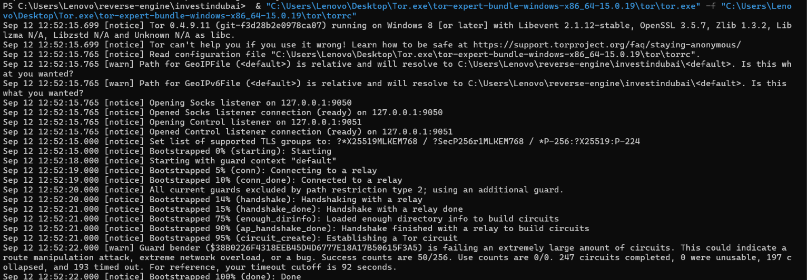
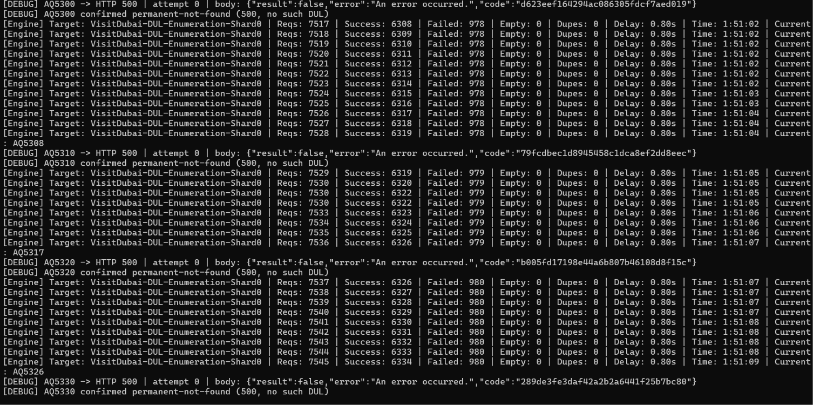
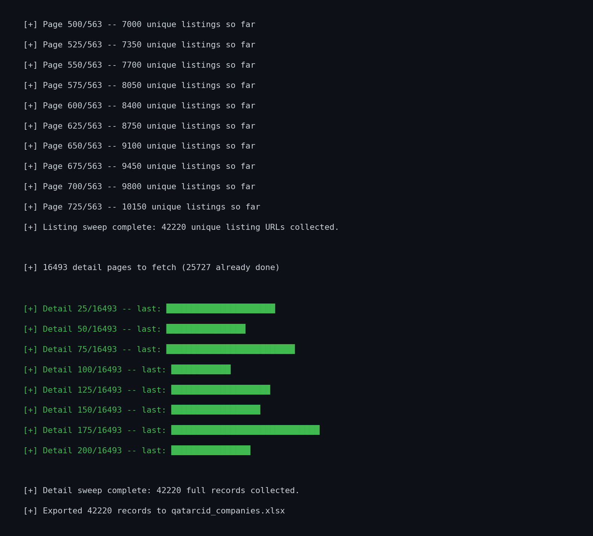
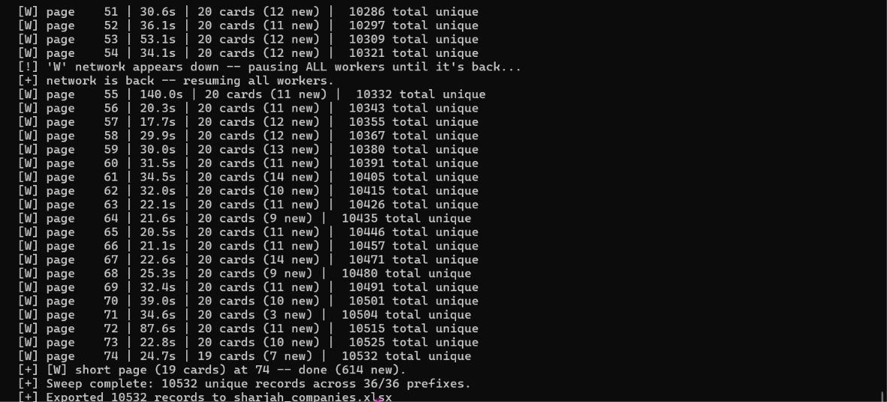
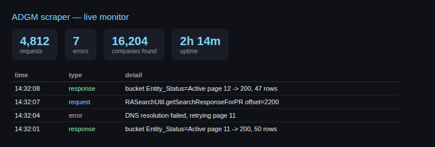
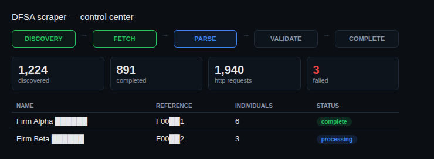
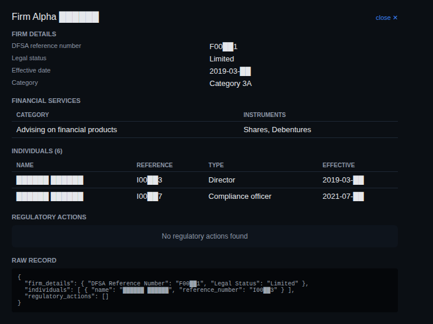

# public-registry-scraper


A full-coverage extraction pipeline for public company registries — solves each registry's own access barrier once (a captcha-gated search form, a hard offset ceiling, an undiscovered internal API), then replays or systematically walks the registry's own backend directly to pull every registered entity. What started as a single-target scraper (DMCC) grew into a small library of registry-specific pipelines, each shaped by whatever that registry's backend actually does under the hood — seven so far: **DMCC, DIFC, ADGM, DFSA, JAFZA/Invest Dubai, Qatar Chamber (qatarcid), and Sharjah Chamber**.

---

## Table of Contents

- [Overview](#overview)
- [How It Works](#how-it-works)
- [The Journey](#the-journey)
  - [DMCC — the origin](#dmcc--the-origin)
  - [DIFC — the prefix-sweep problem](#difc--the-prefix-sweep-problem)
  - [ADGM — the offset ceiling](#adgm--the-offset-ceiling)
  - [DFSA — the server-rendered surprise](#dfsa--the-server-rendered-surprise)
  - [JAFZA / Invest Dubai — the captcha that couldn't be replayed](#jafza--invest-dubai--the-captcha-that-couldnt-be-replayed)
  - [Qatar Chamber (qatarcid) — the nonce that wasn't a captcha](#qatar-chamber-qatarcid--the-nonce-that-wasnt-a-captcha)
  - [Sharjah Chamber — no auth, no API, just pagination](#sharjah-chamber--no-auth-no-api-just-pagination)
- [Live Monitoring](#live-monitoring)
- [Sample Output](#sample-output)
- [Features](#features)
- [Project Structure](#project-structure)
- [Installation](#installation)
- [Usage](#usage)
- [Configuration](#configuration)
- [Limitations](#limitations)
- [Roadmap](#roadmap)
- [Links](#links)
- [License](#license)

---

## Overview

Public company registries rarely expose a bulk export or a documented API. Some hide their search form in a cross-origin iframe behind a captcha. Some cap every query at a fixed number of rows with broken pagination. Some enforce a hard offset ceiling that silently truncates anything past a few thousand results. Some sit behind Cloudflare's bot-detection layer entirely. Each of the seven registries in this repo hit a different one of these walls, and each pipeline was shaped by reverse-engineering that specific registry's actual backend behavior — not a generic "scraper template" applied seven times.

<p align="center">
  
  <br/>
  <sub>The search form and result cards — branding and license identifiers redacted.</sub>
</p>

---

## How It Works

Every registry here needed a different core trick to reach full coverage — captcha replay, name-prefix sweeps, status/category partitioning, straightforward server-rendered pagination, or a WordPress AJAX nonce grabbed off a plain page load. The shared shell across all seven is: capture or discover the real backend call, replay it directly with `requests`, checkpoint every unit of work immediately, and export to a clean Excel workbook.

| Registry | Core obstacle | Core trick |
|---|---|---|
| DMCC | Captcha-gated iframe search, no bulk export | Solve once via browser, replay the captured Visualforce Remoting call |
| DIFC | Backend search cap on result count | Two-letter/numeric name-prefix sweep + license-number range sweep |
| ADGM | Hard ~2,000-row OFFSET ceiling | Partition by Entity Status → Category → name-prefix as a last resort |
| DFSA | No documented API, but fully server-rendered pages | Walk the AJAX listing endpoint directly; detail pages need one plain GET, no browser |
| JAFZA / Invest Dubai | hCaptcha proof-of-work token minted client-side | Let a real browser mint the token, intercept the resulting network call |
| Qatar Chamber (qatarcid) | Cloudflare on the search-page URL pattern, plus a rotating WordPress AJAX nonce | Bootstrap cookies + nonce from a plain (non-challenged) page, then walk the AJAX endpoint directly |
| Sharjah Chamber | No API, no cookies, no captcha — but network-level geo-filtering on non-UAE IPs | Plain GET pagination sweep by name-prefix, once routed through a UAE-based egress |

<p align="center">
  
</p>

---

## The Journey

Each registry went through its own real debugging arc. Documented separately below since the dead ends and the fixes were genuinely different each time.

### DMCC — the origin

**1. Started with browser automation (Playwright)** — driving a real Chromium instance through the visible search form, only to discover the form isn't on the visible page at all: it's inside a cross-origin iframe, invisible to naive DOM selectors until specifically targeted with a frame-scoped locator.

**2. Hit reCAPTCHA on every automated attempt.** Retry loops that re-triggered the checkbox repeatedly escalated the session's risk score into the full image-challenge puzzle — which can't and shouldn't be automated around. The fix was behavioral, not technical: stop hammering it, solve once, reuse the trust that earns.

**3. Considered IP rotation via Tor** as a way to keep sessions looking fresh, using `stem` to trigger new circuits over the control port and `curl_cffi` to impersonate a real browser's TLS fingerprint.

<p align="center">
  
</p>

<p align="center">
  
  <br/>
  <sub>Tor client bootstrapping a fresh circuit for IP rotation during the Invest Dubai enumeration run.</sub>
</p>

**4. Pivoted to HAR replay** — captured one legitimate, manually-solved session and replayed its authenticated Visualforce Remoting call directly with `requests`, bypassing the DOM and the captcha entirely for every subsequent query.

<p align="center">
  
</p>

**5. Hit a checkpoint-poisoning bug** — early runs marked search terms as "complete" even when the request had failed outright (network error, expired session), silently corrupting future resumes into skipping everything. Fixed by only checkpointing a term after a verified, successful response.

<p align="center">
  
</p>

**6. Found the real pagination behavior was fake** — every page/offset parameter returned identical results; the endpoint simply hard-caps results per query.

**7. Landed on alphabetical query iteration with Tor rotation and captcha defense** as the reliable way to reach full registry coverage. Took two full days running sequentially; the resulting scraper is considered frozen and final.

<p align="center">
  
  <br/>
  <sub>Query iteration in action against the Salesforce endpoint — a capped query fans out into deeper sub-queries.</sub>
</p>

Result: **41,000+ businesses** scraped.

### DIFC — the prefix-sweep problem

DIFC's business directory had a claimed 8,000+ entries and, like DMCC, a hidden per-query result cap with no working pagination parameter. The listing pass initially tried simple alphabetical queries — but the directory's naming distribution meant many single-letter prefixes still exceeded the cap on their own.

**1. Two-letter/numeric prefix sweep** — expanded the query space to 686 total prefix combinations, which cracked the cap for the vast majority of the directory.

**2. Residual gap discovered** — even at 686 prefixes, some companies with unusual naming still weren't surfacing in any prefix bucket.

**3. License-number range sweep as a backstop** — swept the full plausible range of license numbers (~1–14,500) directly, catching entries the name-based sweep missed entirely.

**4. Deduplication and enrichment** — merged both sweeps by license number and enriched each hit with the full detail record.

Result: **5,777+ enriched company records** exported to Excel.

### ADGM — the offset ceiling

ADGM's public registrar runs on Salesforce Aura/Experience Cloud, with no authentication required — `aura.token="null"` works for both the search (`RASearchUtil.getSearchResponseForPR`) and detail (`RAPRPageFlowController`, ~18–20 fixed tabs per company) endpoints.

**1. Confirmed the true total** — roughly 18,398–18,452 companies, verified against the registry's own reported count.

**2. Hit Salesforce's OFFSET ceiling** — any query, regardless of filter, silently stopped returning new rows past roughly 2,000 offset, even with results clearly remaining.

**3. Partitioned by Entity Status** — 20 confirmed real status values, each queried independently to reset the offset ceiling per partition.

**4. Partitions still exceeding 2,000 for some statuses** — added a second split by Category (3 values), and a name-prefix sweep as a last-resort third split for any partition still too large.

**5. Built dual-file architecture** — `adgm_scraper.py` as the pure API client module, `run_adgm.py` as the driver/CLI with `--probe`, `--probe-buckets`, and checkpoint/resume support, kept separate so the scraper stays independently testable.

**6. Hit a transient DNS resolution failure mid-run** — a genuine network drop, not a code bug. The checkpoint/retry logic handled it correctly, failing only the affected page for retry on the next run rather than corrupting the whole partition.

Result: near-complete coverage of ADGM's ~18,400 companies, run from `adgm_scraper/` with a live local monitor dashboard.

### DFSA — the server-rendered surprise

DFSA's public register was chosen over the alternative (SHAMS) specifically because it's confirmed, complete, and well-structured — 1,224 firms via faceted search, versus SHAMS's unclear community directory.

**1. Mapped the five sub-registers** — firms (1,224), individuals (4,063), funds (294, plus a `sub_funds/` path variant), passported-funds, and prohibited-individuals (25, ongoing).

**2. Reverse-engineered the AJAX listing contract** — a `getTotal` endpoint returns a JSON count with no CSRF token needed, while the actual paged listing needs a bootstrapped `csrf_token` and returns raw HTML row fragments, 10 per page, walked until an empty page rather than trusting `total // 10`.

**3. Expected detail pages to need browser automation for tabbed content — they didn't.** A plain `requests.get()` on a firm or individual detail page returned the entire tabbed content (Individuals, Regulatory Actions, etc.) in the initial HTML response. The tabs are pure CSS/JS show-hide, not separate AJAX calls, so no Playwright was needed for this stage at all.

**4. Corrected an early parsing assumption** — the initial parser assumed detail-page tables were a concatenated text blob needing regex splitting. The real DOM turned out to use the same clean `<div class="table-row">` positional structure as the listing pages, so positional indexing replaced the regex approach entirely.

**5. Built a real-time control center** — a FastAPI + WebSocket dashboard (`dashboard.py` / `dashboard.html`) that bridges the scraper's synchronous worker thread into the async event loop via a thread-safe queue, showing a live pipeline view (Discovery → Fetch → Parse → Validate → Complete), per-firm status, and a raw-record inspector — while keeping the dashboard entirely optional and decoupled from the scraper's core logic.

**6. Fixed a reconnect race condition** — a client could disconnect mid-replay of the event history (e.g. a page refresh reconnecting before the previous socket had torn down), which raised an uncaught `WebSocketDisconnect` inside the history-replay loop. The scraper itself, running in a separate thread, was unaffected — but the dashboard showed "disconnected" until the exception was caught and the dead connection cleaned up.

### JAFZA / Invest Dubai — the captcha that couldn't be replayed

The Invest Dubai search endpoint includes a `token` field in its request body — an hCaptcha proof-of-work token of type `hsw`, minted entirely client-side by hCaptcha's own JavaScript at the moment a real search fires in the browser.

**1. Attempted direct replay** — same approach as DMCC's captcha bypass — but the token is single-use and tied to a specific challenge state; it can't be forged or pre-generated outside the browser.

**2. Fell back to browser-driven interception** — let a real page perform the search (its own JS mints a valid token naturally), and intercept the resulting network call rather than trying to construct the request from scratch.

<p align="center">
  
  <br/>
  <sub>Invest Dubai brute-force DUL enumeration in progress — confirmed permanent-not-found codes tracked alongside live success/fail counters.</sub>
</p>

**3. Layered in geographic matching for JAFZA enrichment** — a separate `matcher.py` normalizes company names and scores them by core-token overlap (filtering common noise tokens) to reconcile JAFZA listings against Google Places results, pulled via the Places API using a key read from `GOOGLE_MAPS_API_KEY` — never hardcoded.

### Qatar Chamber (qatarcid) — the nonce that wasn't a captcha

qatarcid.com — the Qatar Chamber's Commercial & Industrial Directory — is a WordPress site built on the PointFinder directory plugin, sitting behind Cloudflare. First impression suggested this would need the same browser-interception treatment as JAFZA.

**1. Burp-captured a real search session** and found the root search URL (`/?...&action=pfs`) returning a hard `403` with a Cloudflare "Just a moment..." JS-challenge page — `Cf-Mitigated: challenge` in the response headers confirmed it wasn't a generic block.

**2. Found the real data endpoint wasn't behind the challenge at all.** The page's own JavaScript doesn't hit that URL for data — it calls a separate WordPress AJAX handler (`/wp-content/plugins/pointfindercoreelements/includes/pfajaxhandler.php`, `action=pfget_listitems`) directly, which returned a clean `200` with the full result HTML fragment, no challenge in sight.

**3. Found the nonce source.** Every AJAX call requires a `security` parameter — a per-action WordPress nonce. It isn't static: it's generated fresh per page load and embedded in a `var theme_scriptspf = {...}` JS object on any plain page render (confirmed via `wp_localize_script` convention), keyed by action name (`pfget_listitems`, `pfget_itemcount`, etc.). Loading a plain, non-challenged page once and regexing that object out solved the whole "session" problem without ever touching a captcha.

**4. Confirmed the true scale via `data-foundposts`** — the search response's wrapper `<div>` carries the live total count (42,220) directly as a data attribute, and each page returns exactly 14 cards, giving a clean, calculable page count (563) instead of guessing at a cap.

**5. Discovered detail pages needed a second stage.** Search-result cards only expose name, category, and the detail-page URL — full company data (CR number, QCCI membership number, phone, email, address, opening hours) lives on each `/listing/<slug>/` page, in a simple, consistent `<span class="pf-ftitle">Label</span><span class="pfdetail-ftext">Value</span>` pair structure.

**6. Iterated the parsing tool itself mid-investigation** — the first Burp-XML-to-summary parser truncated every response preview to 300 characters, hiding the actual listing cards and nonce object. Added a `--dump` mode to write complete, untruncated request/response bodies to disk, which is what actually surfaced the `theme_scriptspf` nonce object and the detail-page field markup.

<p align="center">
  
  <br/>
  <sub>Detail-page sweep in progress — business names redacted; listing and detail counts are real run output.</sub>
</p>

**7. Rewrote the client around Scrapling + curl_cffi** for a second, hardened pass — a `StealthySession(solve_cloudflare=True)` bootstrap that clears the Cloudflare Turnstile interstitial itself (rather than depending on a manually re-harvested `cf_clearance` cookie), then hands off to `curl_cffi` with Chrome TLS/JA3 impersonation for all bulk AJAX and detail-page traffic — plus a sliding-window worker pool, 429/`Retry-After` handling, and a one-shot session re-bootstrap on `403` shared safely across threads.

Result: **42,220 listings** discovered; **25,727+ full detail records** collected in the first pass, checkpointed and resumable to completion.

### Sharjah Chamber — no auth, no API, just pagination

Sharjah's business directory (`sharjah.gov.ae/en/knowledge-center/business-directory/`) turned out to be the simplest of the seven once one real blocker was cleared — but that blocker had nothing to do with the application layer.

**1. Every request timed out at the raw TCP level** — not a 403, not a captcha, a plain connection timeout confirmed independently via `curl -v` outside of Burp entirely. This ruled out a proxy misconfiguration and pointed at network-level geo-filtering: the site appears to reject or silently drop connections from non-UAE IP ranges.

**2. Fixed by routing through a UAE-based VPN.** Once the browser's VPN connection was mirrored inside the scraping VM (which had been running unprotected), the exact same requests succeeded immediately — same site, same code, only the egress IP changed.

**3. Found the whole directory is plain server-rendered HTML** — no AJAX, no JSON API, no CSRF token, no cookies, no Cloudflare. Every result page is a single `GET` with `company=<prefix>`, `page=<n>`, and a `validTill=<date>` parameter that turned out to just be today's date, not a session token.

**4. Confirmed single-character prefixes already reach deep, genuine pagination** rather than a truncating cap — the letter "A" alone runs to 3,039 pages at 20 cards each, so a simple A–Z plus 0–9 sweep reaches full coverage without needing DIFC's two-character escalation.

**5. Confirmed end-of-results detection two ways** — a prefix's final page returning fewer than the full 20-card page size, verified directly against the real tail page (`page=3039` for "A" returned exactly 11 cards).

**6. Investigated the LinkedIn/Facebook/WhatsApp icons on each card** before assuming they were scrapable data — they resolve to generic `shareArticle`/`sharer`/`send` share-intent URLs with the company name interpolated into the caption, not real per-company social profiles, so nothing further to extract there.

<p align="center">
  
  <br/>
  <sub>Parallel-worker sweep in progress, including a live network-down/auto-resume event mid-run.</sub>
</p>

Result: **10,532 unique records** collected across all 36 prefixes (A–Z, 0–9), including a live-observed network drop and automatic resume mid-run.

---

## Live Monitoring

Two of the seven scrapers ship with a live dashboard for watching a run in progress; the Sharjah scraper additionally supports an optional browser-based HTML monitor.

**ADGM** — a lightweight single-file monitor (`monitor.py`): a background HTTP server on `localhost:8765` serving an auto-refreshing page backed by an in-memory ring buffer of the last 500 events, with request/error/companies-found counters and uptime.

**DFSA** — a fuller FastAPI + WebSocket control center (`dashboard.py` / `dashboard.html`): a five-stage pipeline view, ten live stat cards (discovered, fetched, parsed, completed, resumed-from-checkpoint, failed, requests, retries, saved, save-failures), a live activity feed with expandable raw event JSON, a dedicated error feed, and a company table that opens into a full per-firm detail view — including financial services, individuals, and regulatory actions.

**Sharjah** — an optional `--dashboard` flag starts a zero-dependency `http.server`-based live monitor at `localhost:8766`: live cards for current prefix/page, unique record count, requests/sec, error count, and elapsed time, a per-prefix progress bar, and a scrolling event log — all polled via a simple `fetch()` loop against a `/api/status` JSON endpoint, no external JS libraries.

<p align="center">
  
  <br/>
  <sub>ADGM monitor layout — illustrative mockup with placeholder values, not a live capture.</sub>
</p>

<p align="center">
  
  <br/>
  <sub>DFSA control center layout — illustrative mockup, company names blurred.</sub>
</p>

Clicking into a company row on the DFSA dashboard opens a full detail view — firm fields, financial service categories, individuals, regulatory actions, and a raw-record JSON inspector for debugging.

<p align="center">
  
  <br/>
  <sub>DFSA company detail view — illustrative mockup, values blurred.</sub>
</p>

---

## Sample Output

Every row carries the full registry schema for that source — English & local-language name, license/reference number, issue/expiry dates, address, activities, and status, plus (for DFSA) individuals and regulatory actions, and (for Qatar/Sharjah) contact details and opening hours where applicable — deduplicated across every overlapping query or sweep used to reach it.

<p align="center">
  
  <br/>
  <sub>Column structure of the final export — sample values shown, real identifiers redacted.</sub>
</p>

---

## Features

| Feature | Detail |
|---|---|
| **Captcha-free bulk extraction** | Solve once manually (DMCC, JAFZA), skip entirely where no auth is required (ADGM, DFSA, Sharjah), or bootstrap a rotating nonce from a plain page load (Qatar) |
| **Registry-specific cap workarounds** | Prefix sweeps, status/category partitioning, license-range sweeps, or plain confirmed-total pagination depending on what each backend actually enforces |
| **Cloudflare-aware routing** | Qatar's scraper distinguishes challenged vs. non-challenged endpoints on the same domain, and ships a Scrapling + curl_cffi hardened variant for full Turnstile clearance |
| **Deduplication** | Collapses overlapping matches across queries, sweeps, or partitions by license/reference number |
| **Checkpointing** | Every unit of work (query, partition, firm, page, prefix) is saved immediately — network drops or session expiry never cost lost progress |
| **Resumable sessions** | Drop in a freshly captured HAR (DMCC) or just re-run (ADGM, DFSA, Qatar, Sharjah) to resume exactly where the last run stopped |
| **Optional Tor routing** | Circuit rotation available for IP-sensitive runs |
| **Live monitoring** | Real-time dashboards for ADGM, DFSA, and Sharjah runs |
| **Excel export** | Clean, formatted, auto-sized workbook per registry, ready to hand off |

---

## Project Structure

```
scrape_direct_all.py        DMCC pipeline: query iteration + checkpointing + Excel export
scrape_tor_all.py           Tor-routed variant of the DMCC pipeline (optional IP rotation)
scrape_registry_generic.py  Playwright-based DOM automation fallback (captcha-gated, manual-solve)
env_config.py               shared Playwright environment/proxy/retry configuration
app/core/har_parser.py      normalizes exported .har files into request/response records
difc_scraper.py             DIFC pipeline: prefix sweep + license-number range sweep

adgm_scraper/
  adgm_scraper.py           API client module (Salesforce Aura/Experience Cloud)
  run_adgm.py                driver/CLI: --probe, --probe-buckets, checkpoint/resume
  monitor.py                 lightweight live dashboard (localhost:8765)
  tor_rotation.py             Tor control-port circuit rotation
  test_adgm_tor_integration.py

dfsa_scraper/
  dfsa_common.py             shared session/CSRF/pagination logic across sub-registers
  dfsa_registers.py           register-listing walker
  dfsa_firm_detail.py         firm detail-page parser
  dfsa_individual_detail.py   individual detail-page parser
  dashboard.py                 FastAPI + WebSocket live control center
  dashboard.html                control center frontend
  events.py                    EventBus used to bridge scraper thread -> dashboard
  run_register.py / run_individuals.py / run_scraper.py
  run_scraper_with_dashboard.py

jafza_scrapper/
  config.py                   reads GOOGLE_MAPS_API_KEY from environment
  places_client.py             Google Places enrichment client
  matcher.py                    name-normalization + token-overlap matching for enrichment
  run_enrich.py

scrape_invest_dubai/
  scrape_invest_dubai.py      hCaptcha token interception via browser-driven search

qatrcid/
  qatarcid_scraper.py         nonce bootstrap + AJAX pagination + detail-page sweep + Excel export
  parse_burp_xml.py            general-purpose Burp XML summarizer/dumper used to reverse-engineer the endpoint

sharjah-scrapper/
  sharjah_scrape.py            plain GET prefix-pagination sweep, checkpointed, optional --dashboard live monitor

checkpoint.json / *_checkpoint.json    in-progress run state (gitignored)
output/ / output_schemas/               generated Excel output (gitignored)
*.har                                    captured authenticated sessions (gitignored, expire)
```

---

## Installation

```powershell
python -m venv venv
venv\Scripts\activate
pip install -r requirements.txt
playwright install chromium
```

For JAFZA enrichment, also set a Google Maps API key:

```powershell
$env:GOOGLE_MAPS_API_KEY="your_key_here"
```

For the Qatar (qatarcid) Scrapling-hardened variant:

```powershell
pip install "scrapling[fetchers]" curl_cffi openpyxl
scrapling install
```

---

## Usage

**DMCC / DIFC — HAR-based captcha bypass:**

1. Open the target registry's search page in a real Chrome window
2. DevTools (F12) → Network tab → Preserve log
3. Fill in the search form, solve the captcha manually, submit
4. Right-click the Network panel → **Save all as HAR with content**
5. Save the file in the project root, then run:

```powershell
python scrape_direct_all.py       # DMCC
python difc_scraper.py            # DIFC
```

**ADGM — no auth needed, run directly:**

```powershell
cd adgm_scraper
python run_adgm.py --probe          # verify bucket totals before a full run
python run_adgm.py                  # full run, checkpointed
python monitor.py                   # optional, in a separate terminal — open localhost:8765
```

**DFSA — no auth needed, optional live dashboard:**

```powershell
cd dfsa_scraper
python run_scraper_with_dashboard.py
uvicorn dashboard:app --reload --port 8000   # optional, in a separate terminal — open localhost:8000
```

**JAFZA / Invest Dubai:**

```powershell
cd scrape_invest_dubai
python scrape_invest_dubai.py

cd ../jafza_scrapper
python run_enrich.py
```

**Qatar Chamber (qatarcid):**

```powershell
cd qatrcid
python qatarcid_scraper.py --probe          # sanity check: nonce + page 1 only
python qatarcid_scraper.py                  # full run, resumable
python qatarcid_scraper.py --export-only    # re-export current checkpoint to Excel
```

**Sharjah Chamber:**

```powershell
cd sharjah-scrapper
py -3.13 sharjah_scrape.py --probe          # sanity check: prefix 'A', page 1 only
py -3.13 sharjah_scrape.py                  # full A-Z + 0-9 sweep, resumable
py -3.13 sharjah_scrape.py --dashboard      # same, with a live monitor at localhost:8766
```

> **Note:** Sharjah's site appears to geo-filter or drop connections from non-UAE IP ranges at the network level (confirmed via plain `curl` timeouts). A UAE-based VPN/proxy on the machine actually making the requests is required — this isn't something the scraper itself can work around.

Output for each: an Excel workbook in that scraper's own output path. Progress and resumability: each scraper's respective checkpoint file. If a session-bound scraper's session expires mid-run (repeated API error lines instead of new-row counts), recapture a fresh HAR and re-run the same command — nothing already fetched is lost.

---

## Configuration

| Setting | Controls | Applies to |
|---|---|---|
| `CAP` | The endpoint's per-query result cap that triggers query splitting | DMCC, DIFC |
| `search_terms` / prefix set | Starting alphabet/digit/prefix set before splitting kicks in | DMCC, DIFC, Sharjah |
| `depth < 4` (in `process_term`) | Maximum recursion depth for term-splitting, as a safety ceiling | DMCC |
| Entity Status / Category buckets | Partition values used to reset the offset ceiling | ADGM |
| `CHECKPOINT_PATH` / `*_checkpoint.json` | Where in-progress state is saved for resumability | All |
| `GOOGLE_MAPS_API_KEY` | Places enrichment lookups | JAFZA |
| `TOR_CONTROL_PASSWORD` | Optional — only needed if torrc is switched from cookie auth to `HashedControlPassword` | DMCC, ADGM |
| `theme_scriptspf` nonce bootstrap URL | Which plain page to load for cookie + nonce extraction | Qatar |
| `--dashboard-port` | Live monitor HTTP port (default 8766) | Sharjah |
| `time.sleep(...)` calls | Pacing between requests | All |

---

## Limitations

| Limitation | Detail |
|---|---|
| **Session-bound (DMCC, JAFZA)** | Requires a manually captured, authenticated HAR session or browser interception — cannot run fully unattended from a cold start |
| **Session lifetime** | Session tokens expire; long runs may need a mid-run HAR recapture |
| **No official API for any registry** | Depends on each target's current internal implementation; a site redesign could break any endpoint contract |
| **Recursion/partition depth ceilings** | Extremely dense query branches or partitions beyond the configured limits could theoretically still be capped |
| **hCaptcha token is single-use** | Invest Dubai's token can't be pre-generated or reused — every search needs a fresh browser-driven interception |
| **Qatar nonce rotates** | The `theme_scriptspf` AJAX nonce can expire mid-run on a long session; the scraper re-bootstraps automatically on a `403`, but this depends on Cloudflare's clearance cookie still being valid |
| **Sharjah is geo-filtered at the network layer** | Requires the scraping machine to have a UAE-based egress IP; the scraper has no application-layer workaround for this |

---

## Roadmap

- [ ] Automatic session refresh via a headless captcha-solve fallback for long unattended runs
- [ ] Configurable partition/recursion strategy (skip low-yield branches automatically, based on observed patterns)
- [ ] Cross-run diffing to track new/updated registrations over time
- [ ] Unified live dashboard covering all seven registries, not just ADGM, DFSA, and Sharjah
- [ ] Additional registries beyond the current seven

---

## Links

- [Playwright for Python](https://playwright.dev/python/)
- [HAR (HTTP Archive) format](https://en.wikipedia.org/wiki/HAR_(file_format))
- [Tor Project](https://www.torproject.org/)
- [stem (Tor control library)](https://stem.torproject.org/)
- [FastAPI](https://fastapi.tiangolo.com/)
- [Scrapling](https://github.com/D4Vinci/Scrapling)
- [curl_cffi](https://github.com/yifeikong/curl_cffi)

---

## License

MIT — see `LICENSE`.